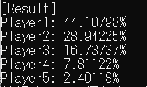

## 共通
`ODDS`: 各プレイヤーの得点確率を格納したリスト(list[float])  
`GOAL`: 勝ち抜け点数(int)

# by_trial.py
`REPEAT`: 試行回数(int)

1000万回で15分くらい。  
人数や点数が増えても時間は大して変わらないので検算にでも使ってください。

# by_brute_force.py
アホほど時間がかかるので使う場合はスパコンを導入してください。  
一応3点×5人なら2分くらいで終わります...。